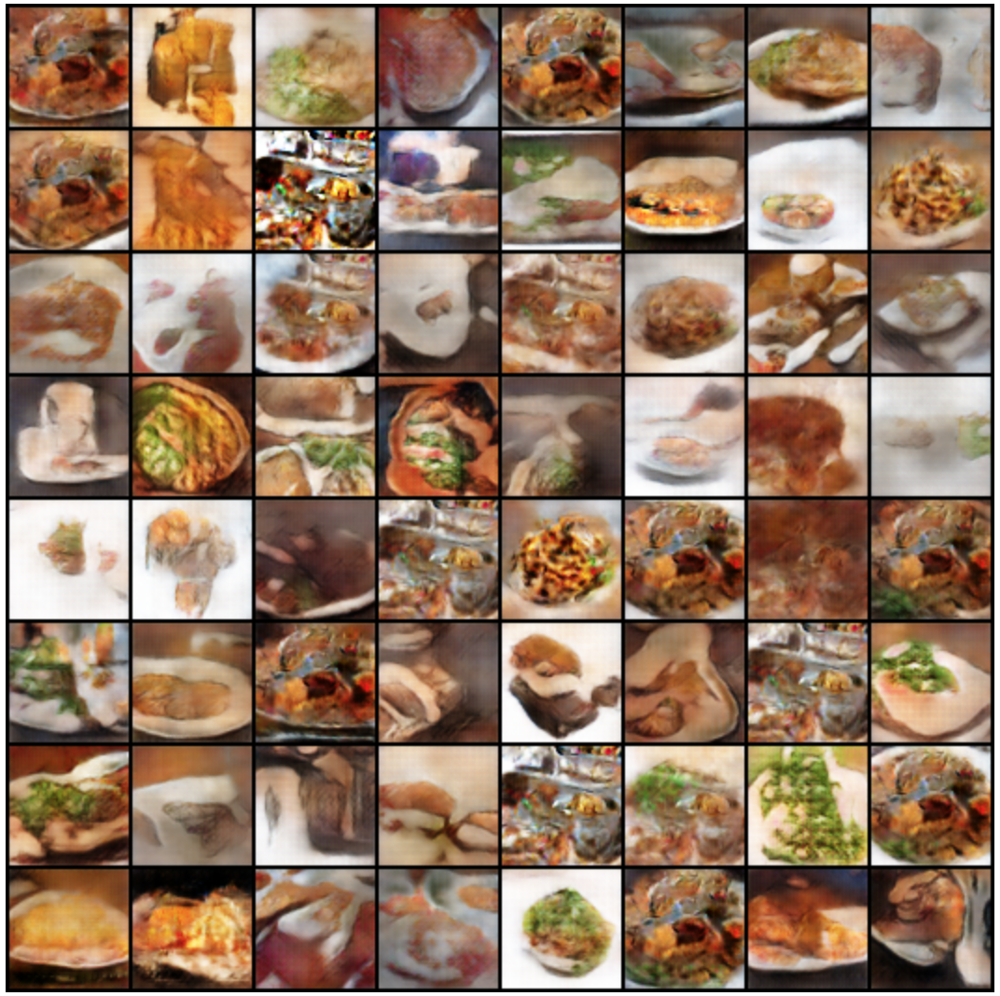
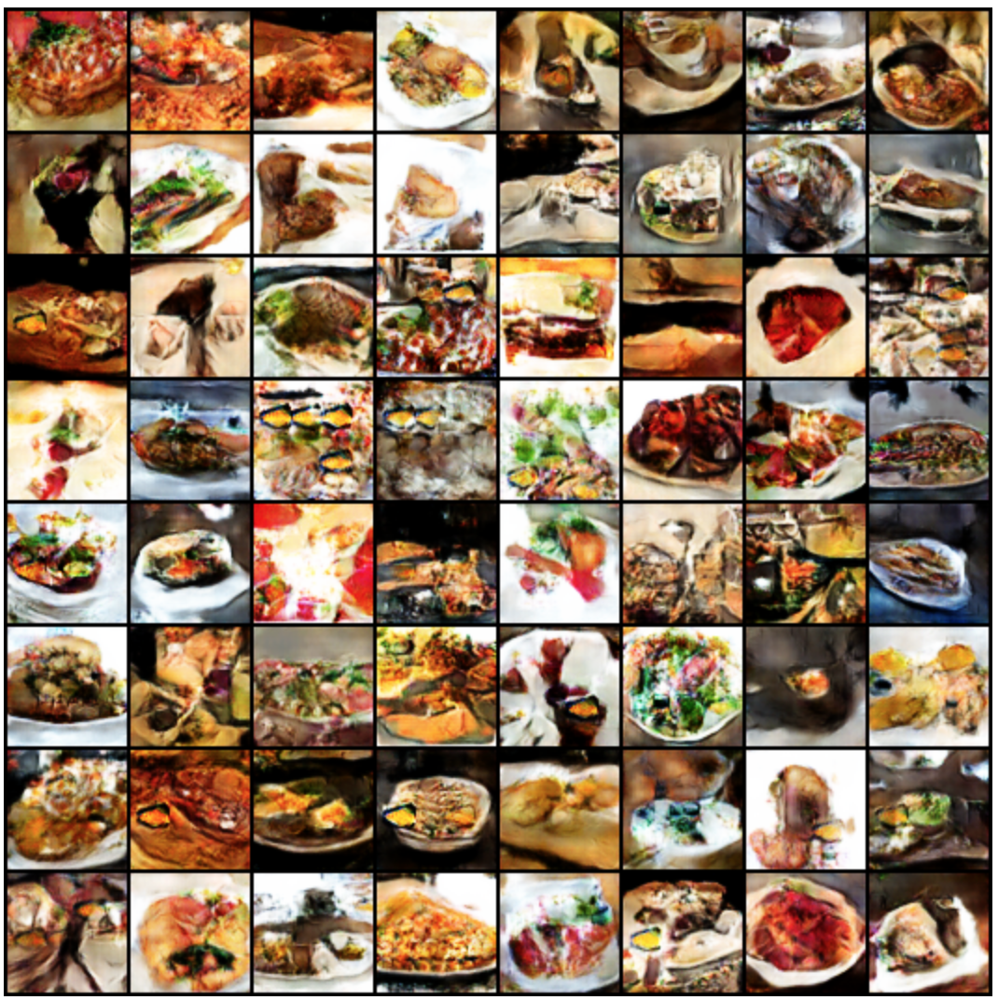
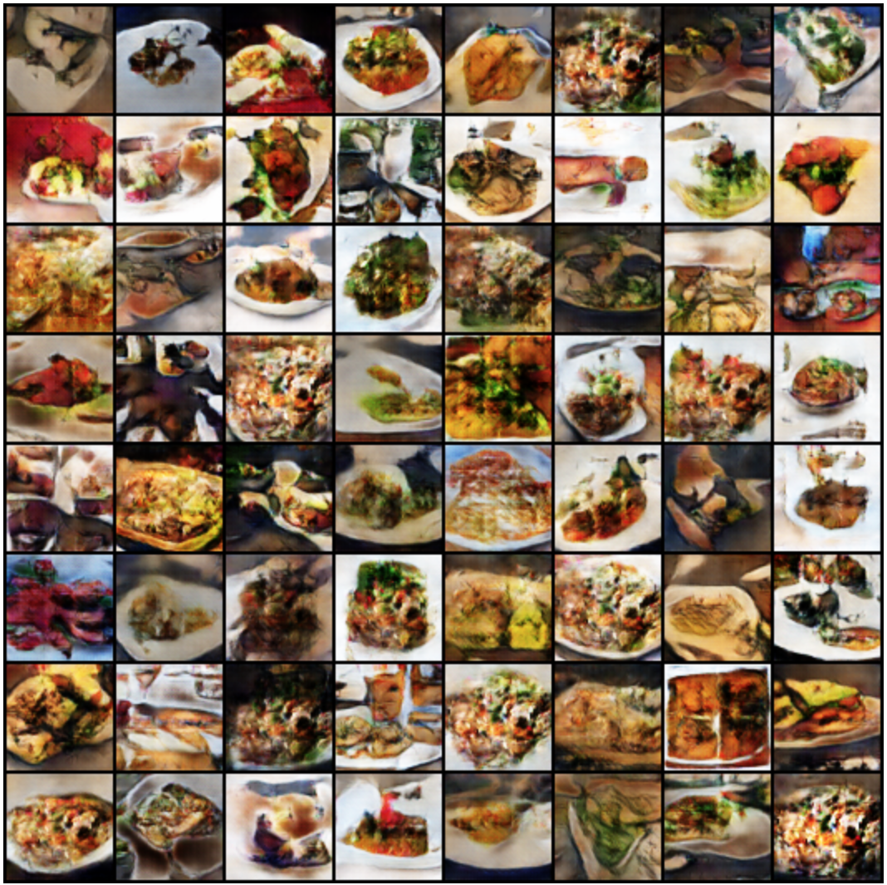
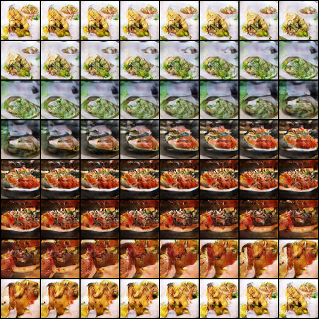

# Generalized Latent Variable Recovery for Generative Adversarial Networks
The Generator of a Generative Adversarial Network (GAN) is trained to transform latent vectors drawn from a prior distribution into realistic looking photos.  These latent vectors have been shown to encode information about the content of their corresponding images.  Projecting input images onto the latent space of a GAN is non-trivial,  but  previous  work  has  successfully  performed  this  task  for  latent  spaces  with  a  uniform prior.  We extend these techniques to latent spaces  with a  Gaussian  prior,  and  demonstrate our technique's effectiveness.  

Our GAN was trained on food photos from the [Yelp dataset](https://www.yelp.com/dataset) and uses the DCGAN architecture in PyTorch.

## Generator Samples

  <a href="samples/gan-long.png">
     
    Standard DCGAN
  </a>

  <a href="samples/gan-ps.png">
     
    Pixel Shuffle DCGAN
  </a>

  <a href="samples/gan-soft.png">
     
    Soft Label DCGAN
  </a>

  <a href="samples/latent-walk.png">
     
    Latent Vector Interpolation (SLERP)
  </a>

## Authors
- [Nicholas Egan](http://nicholasegan.me)
- [Jeffrey Zhang](https://github.com/jzhang12)
- [Kevin Shen](https://github.com/kevinshen11)

## Attributions
Code
- [DCGAN](https://github.com/pytorch/examples/tree/master/dcgan)
- [Recovery for Uniform Prior](https://github.com/yxlao/pytorch-reverse-gan)

Data
- [Yelp Dataset](https://www.yelp.com/dataset)
